# CI/CD Pipeline for Dockerized Portfolio Application (AWS)

This repository demonstrates a complete end-to-end CI/CD implementation using
AWS managed services. The pipeline automates building, packaging, and deploying
a Dockerized Next.js portfolio application to an EC2 instance.

The project focuses on **real-world CI/CD design, debugging, and deployment**
rather than only happy-path automation.

---

## Architecture Overview

The CI/CD architecture follows a GitHub → AWS managed pipeline → EC2 deployment
model.

**Key components**
- GitHub for source control
- AWS CodePipeline for orchestration
- AWS CodeBuild for Docker image build and push
- Docker Hub as image registry
- AWS CodeDeploy for deployment
- EC2 as runtime environment

### Architecture Diagrams

| Diagram | Description |
|------|------------|
| 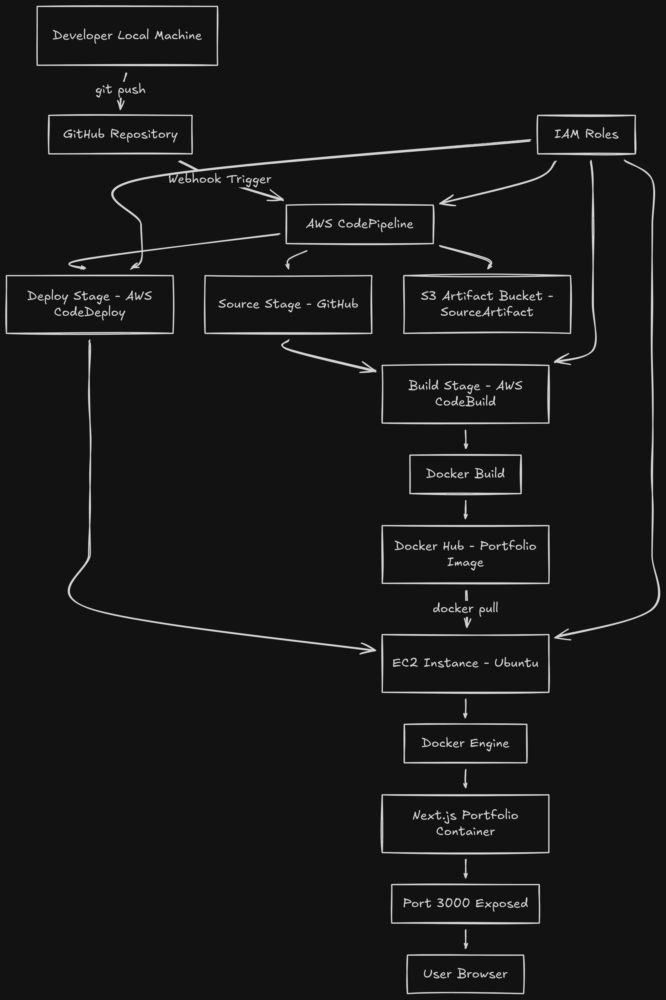 | End-to-end CI/CD architecture |
|  | Pipeline execution flow |
| 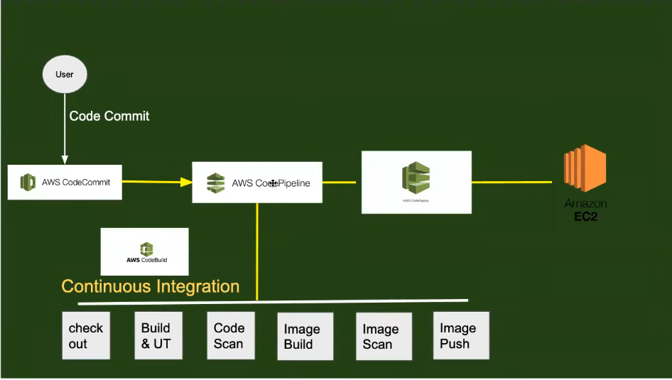 | Reference architecture |

---

## Repository Structure

```
.
├── architecture/ # Architecture diagrams
├── aws_setup/ # AWS setup documentation
├── ci-cd/ # CI/CD configuration files
├── notes/ # Issues and learnings
├── outputs/ # Execution screenshots and logs
├── scripts/ # Deployment scripts
└── Readme.md
```


---

## CI/CD Pipeline (AWS CodePipeline)

The pipeline consists of three stages:
1. Source
2. Build
3. Deploy

### Pipeline Execution


---

## Source Stage (GitHub)

- Source provider: GitHub
- Branch: main
- Trigger: Automatic on push
- Output artifact: `SourceArtifact`

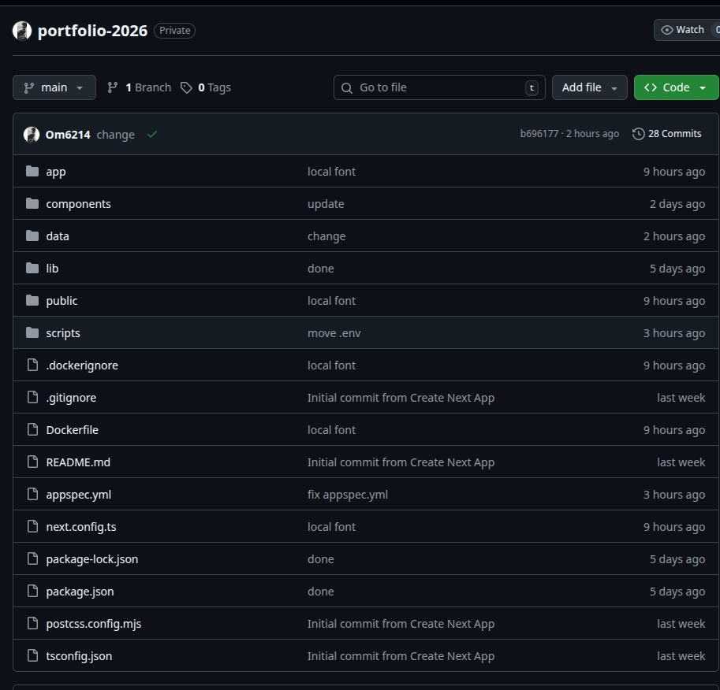

The source artifact contains:
- Application source code
- `appspec.yml`
- Deployment scripts

---

## Build Stage (AWS CodeBuild)

The build stage is responsible for:
- Building Docker image
- Pushing image to Docker Hub

### Build Configuration

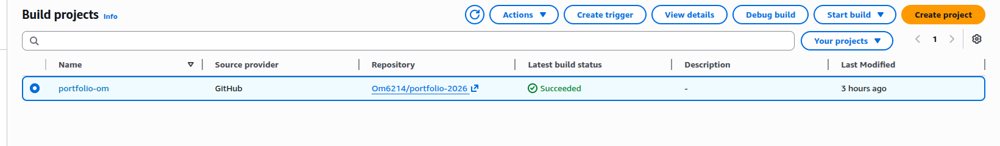
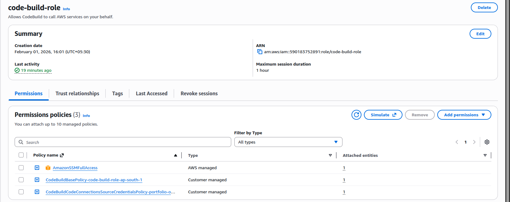

### Build Specification

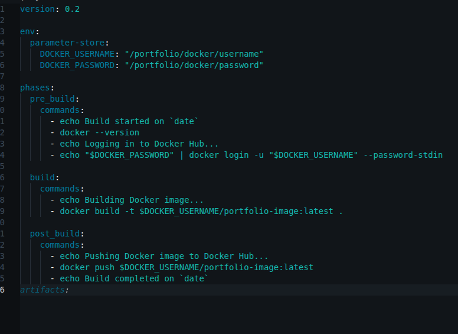

### Build Execution Logs

These logs confirm successful Docker build and push:

- 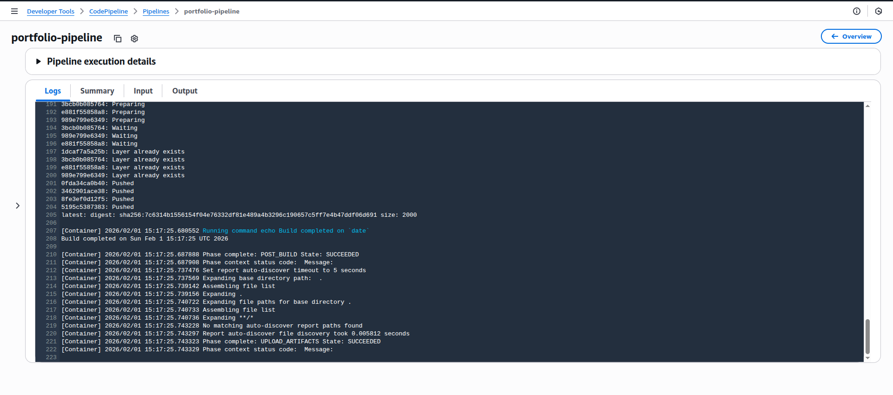
- 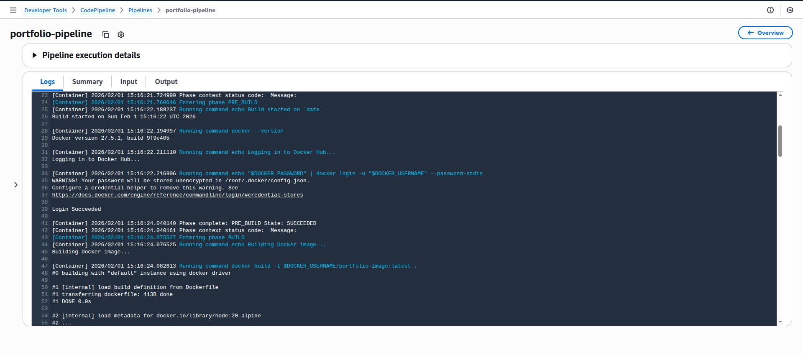

Build executions history:


---

## Artifact Storage (Amazon S3)

AWS CodePipeline stores pipeline artifacts in an S3 bucket.

- Artifact type used: `SourceArtifact`
- Encryption: SSE-S3


---

## Deploy Stage (AWS CodeDeploy)

CodeDeploy is used for in-place deployment to EC2.

### CodeDeploy Configuration

- Deployment type: In-place
- Target: EC2 instance
- Input artifact: `SourceArtifact`


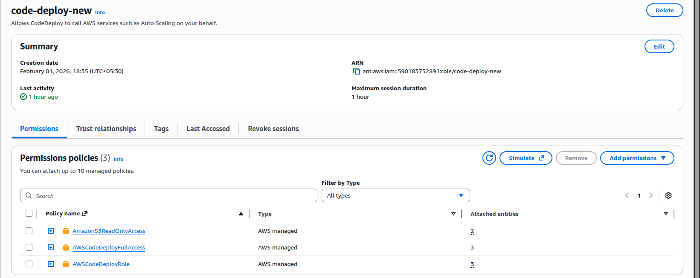

### Deployment History


---

## Deployment Specification and Scripts

### appspec.yml

Defines lifecycle hooks and deployment flow:

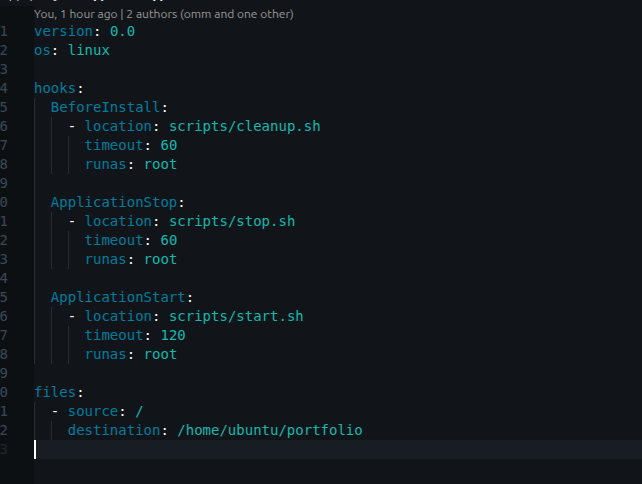

File location:

ci-cd/appspec.yml


---

### Deployment Scripts

Scripts executed by CodeDeploy during deployment:

| Script | Purpose |
|-----|--------|
| `start.sh` | Pull and start Docker container |
| `stop.sh` | Stop and remove running container |
| `cleanup.sh` | Cleanup old containers/images |

Screenshots:
- 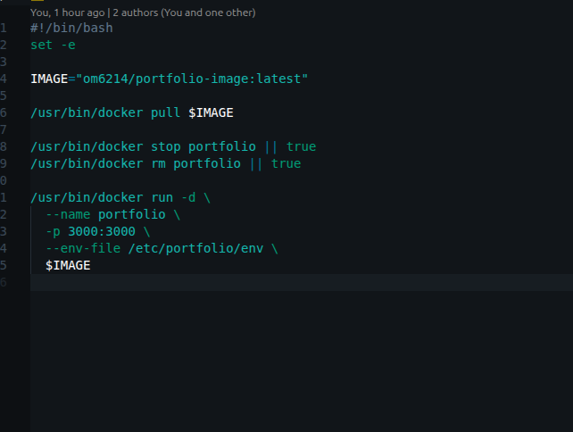
- 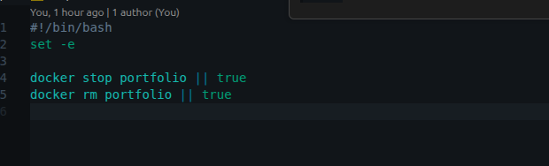
- 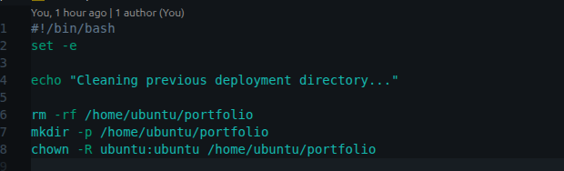

Scripts location:

scripts/

---

## EC2 Infrastructure

### EC2 Instance

- OS: Ubuntu
- Docker installed
- CodeDeploy agent installed

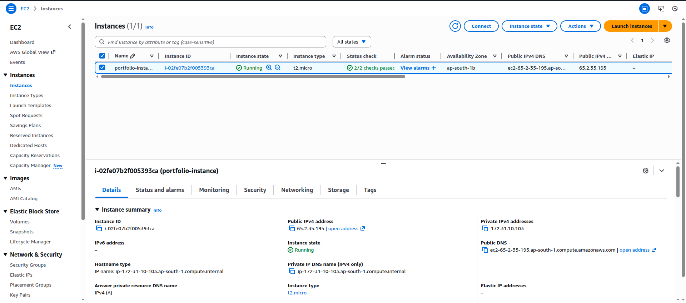
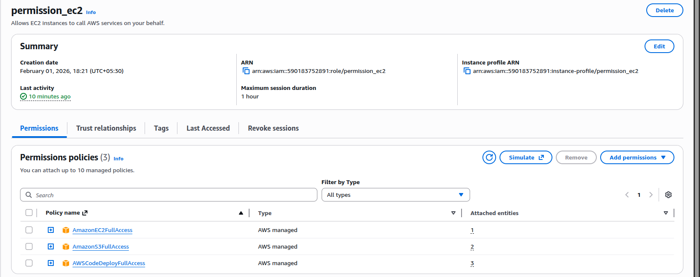
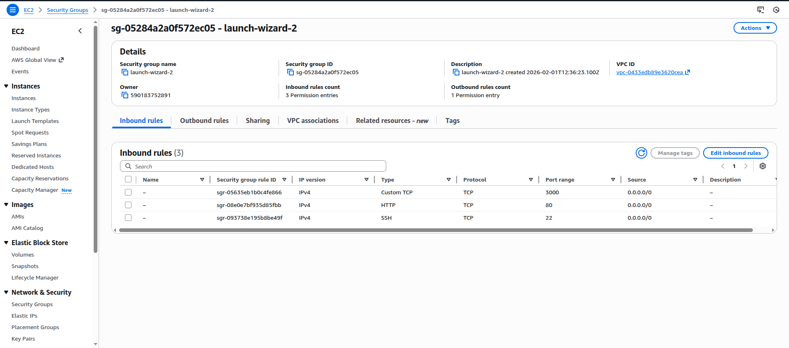

SSH access:

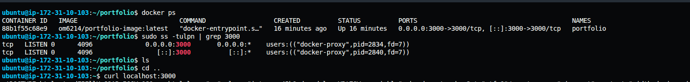

---

## Application Runtime

The application runs inside a Docker container on EC2.

- Container port: 3000
- Access URL: `http://<EC2-PUBLIC-IP>:3000`

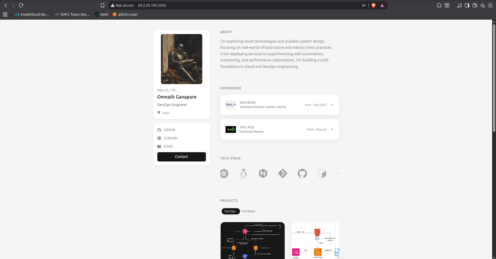

---

## IAM Roles

All IAM roles used in this project are documented separately:

- [IAM Roles Documentation](aws_setup/iam-role.md)

This includes:
- CodePipeline service role
- CodeBuild service role
- CodeDeploy service role
- EC2 instance role

---

## EC2 Setup Documentation

Detailed EC2 configuration steps:

- [EC2 Setup Guide](aws_setup/ec2-setup.md)

---

## Issues Faced and Debugging

The most challenging issue involved artifact configuration between CodeBuild,
CodePipeline, and CodeDeploy.

- [Issues Faced](notes/issue-faced.md)

This section explains:
- BuildArtifact vs SourceArtifact mismatch
- Why the error appeared as a permission issue
- How it was resolved

---

## Key Learnings

Technical and architectural learnings from the project:

- [Project Learnings](notes/learning.md)

---

## Cleanup and Cost Management

After project completion:
- CodePipeline, CodeBuild, CodeDeploy resources were deleted
- EC2 instance and EBS volumes were terminated
- S3 artifact bucket was removed

This ensures no ongoing AWS billing.

---

## Summary

This project demonstrates:
- Real-world CI/CD pipeline design
- Docker-based deployment strategy
- Deep understanding of AWS CI/CD internals
- Debugging of non-obvious cloud errors
- Proper infrastructure cleanup

The focus was on **learning, troubleshooting, and correctness**, not just tool usage.
