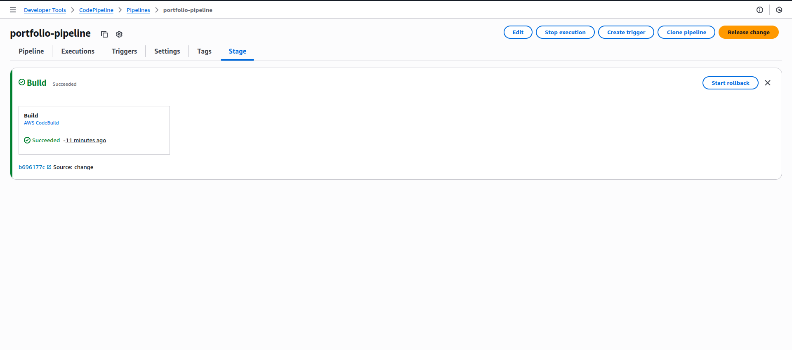
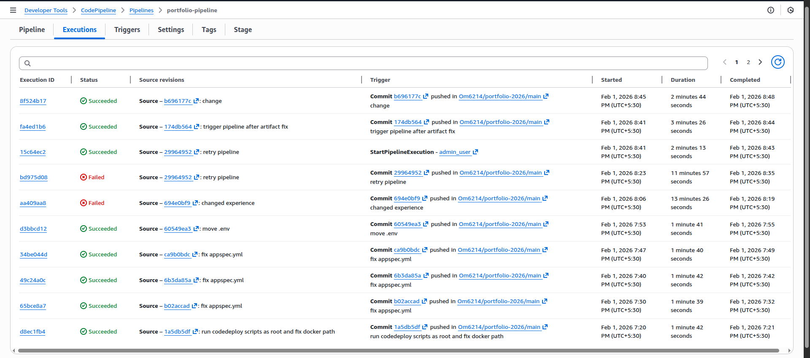
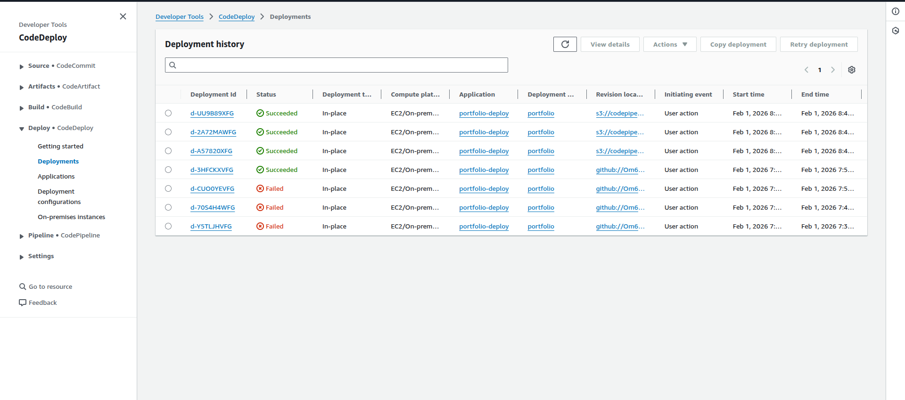
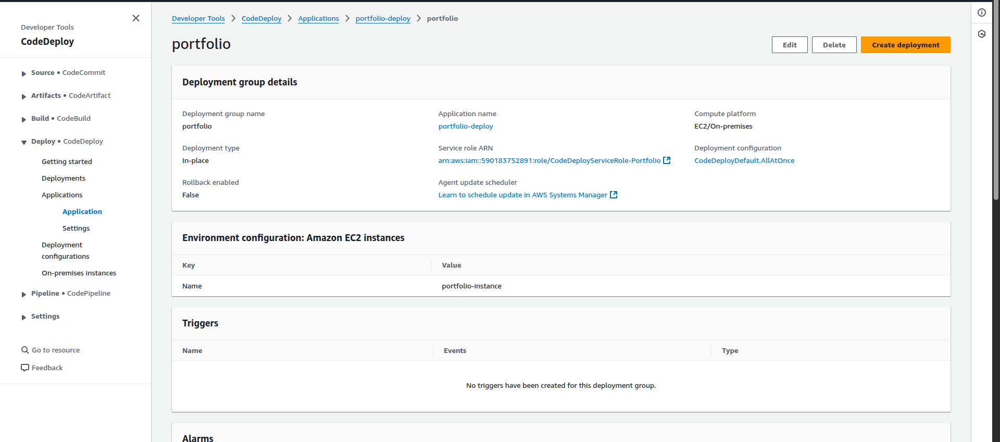
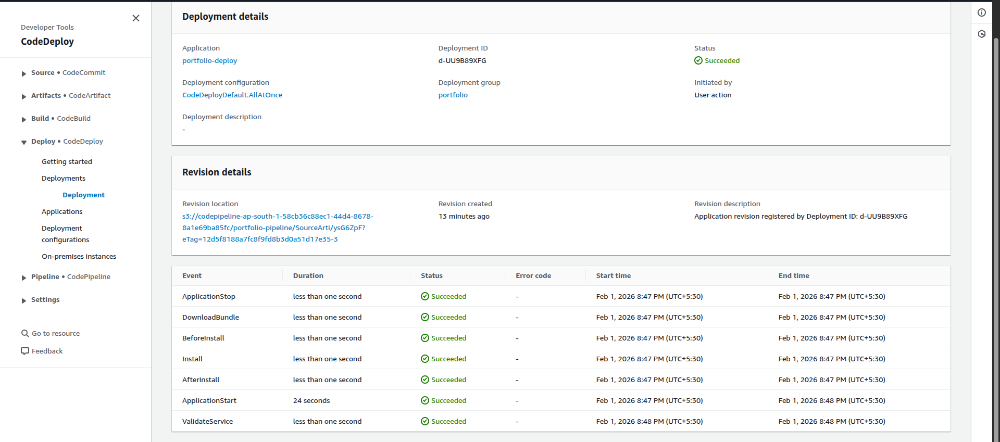

# CI/CD Pipeline Configuration (AWS CodePipeline)

This document explains the complete CI/CD pipeline configuration used to
automate build and deployment of the Dockerized portfolio application.

The pipeline integrates GitHub, AWS CodePipeline, CodeBuild, and CodeDeploy
to deploy the application on an EC2 instance.

---

## Pipeline Overview

The pipeline consists of three stages:

1. Source – Fetch code from GitHub
2. Build – Build and push Docker image using CodeBuild
3. Deploy – Deploy application to EC2 using CodeDeploy

### Pipeline View

---

## Source Stage (GitHub)

The Source stage connects the pipeline to the GitHub repository.

**Configuration**
- Source provider: GitHub (via OAuth / GitHub App)
- Repository: portfolio project repository
- Branch: main
- Trigger: Automatic on every push to main branch

**Purpose**
- Detect code changes
- Package source code as `SourceArtifact`
- Upload artifact to S3 for downstream stages

---

## Artifact Storage (Amazon S3)

AWS CodePipeline automatically stores pipeline artifacts in an S3 bucket.

**Artifact details**
- Bucket: codepipeline-ap-south-1-xxxx
- Artifact used: SourceArtifact
- Encryption: SSE-S3 (Amazon S3 managed keys)

The `SourceArtifact` is used directly by CodeDeploy since the Docker image
is pulled from Docker Hub during deployment.

---

## Build Stage (AWS CodeBuild)

The Build stage uses AWS CodeBuild to build and push the Docker image.

**Responsibilities**
- Build Docker image from Dockerfile
- Authenticate with Docker Hub
- Push image to Docker Hub repository

**Why no build artifact**
- The deployment uses Docker images
- CodeDeploy only requires `appspec.yml` and scripts from SourceArtifact

---

## CodeBuild Execution Logs

Successful build execution confirms:
- Docker image built successfully
- Image pushed to Docker Hub
- Build completed without errors

---

## Deploy Stage (AWS CodeDeploy)

The Deploy stage uses AWS CodeDeploy to deploy the application to EC2.

**Deployment details**
- Deployment type: In-place
- Target: EC2 instance with CodeDeploy agent
- Input artifact: SourceArtifact

CodeDeploy uses:
- `appspec.yml`
- Deployment scripts (`start.sh`, `stop.sh`)

---

## Deployment Group Configuration

The deployment group defines:
- Target EC2 instance
- Service role used by CodeDeploy
- Deployment strategy

---

## Successful Deployment

A successful deployment indicates:
- Artifact downloaded from S3
- Lifecycle scripts executed
- Docker container started on EC2

---

## End-to-End Flow Summary

1. Developer pushes code to GitHub
2. CodePipeline detects change
3. SourceArtifact stored in S3
4. CodeBuild builds and pushes Docker image
5. CodeDeploy deploys application to EC2
6. EC2 pulls Docker image and runs container

---

## Outcome

The CI/CD pipeline fully automates:
- Source integration
- Docker image creation
- Deployment to EC2

This setup ensures consistent, repeatable, and automated deployments
with minimal manual intervention.
